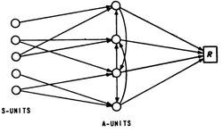
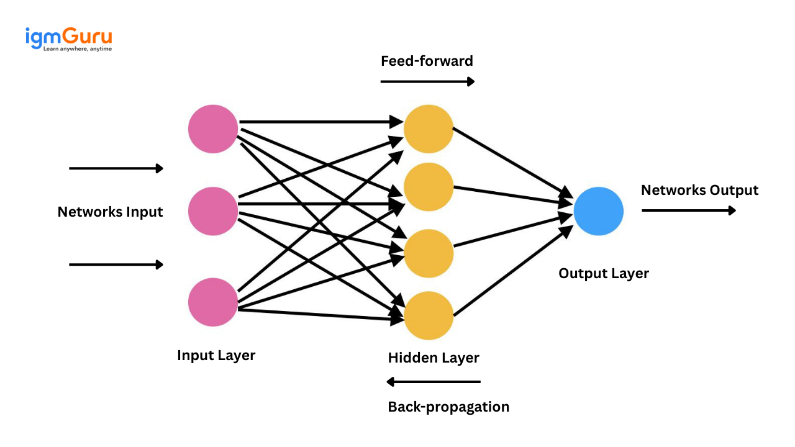

# Multilayer_Perceptron
## General purpose
First approach to artificial neural networks, reacquainted with the manipulation of
derivatives and linear algebra, as they are indispensable mathematical tools for the
success of the project.

### General instructions:
- you can use any language
- No libraries handling the implementation of artificial neural networks or the un-
derlying algorithms are allowed.

## Core notions:
### Artificial neural network
Computational model inspired by the structure and functions of biological neural networks.

### Feedforward Neural network
An artificial neural network, where information flow in a unique direction.
### Backpropagation
Is the gradient computation of a loss fonction, with respect to the weights of the network for a single input–output example. i will calculate one layer at a time, iterating from the last layer.
### Gradient descent
a gradient descent consiste of computing the gradient of a function (here the loss fonction) so we can know how to update or weight betwenn each iteration to minimize this fonction. 

#### Vocabulary
##### Input layer
The entry of the model, the first layer of the artificial neural network, where you give your raw or prefilter data.

##### Hiden layer
The layer that are not connected to the input or output of the model.

##### OutPut layer
The final layer of a artificial neural network, responsible to produce the prediction with the data from preceding layer, often use activation function like softmax or sigmoid.

## Implementation
### Neurone
for each neurone we will have to make compution:

#### Weight sum
We can use numpy to compute the sum of weight
    Z = X @ W + b
with:
- X: the data
- W: the weight
- b: the bias

#### Activation function
here we use the sigmoid function, it compute the output of the neurone
    theta = 1 / (1 + np.exp(-Z))
we also need his derivate to how much the input impact the output: (the gradient for this specific node)
    d_theta = theta * (1 - theta)

### Output layer
has specified on the subject we have to use the softmax function to output as a probabilistic distribution

#### Softmax
for a specific neuron the softmax fonction will be:
    a_i = np.exp(Z_i) / (sum(np.exp(Z))) for the i-th neurone
the output of each node will be between 0-1 and the sum of each of them will 1.

#### Train logic
To improve my model on each iteration, we need to handle the Backpropagation, this requires a Loss Function to measure how far off our predictions are.
the subject specified that you should use the Binary Cross-Entropy for the prediction program.
    E = (-1/n)sum(y_n * log(p_n) + (1 - y_n) * log(1 - p_n))
with:
- y_n: the true label (0 or 1)
- p_n: the probability from the model predict for this label.

##### Update weight
to update the weight i will need to set a learning rate (lr) that we be the step on each iteration, that i multiplie by the gradient of loss so we go in the good direction.
    W = W - lr * EdW (derive de E par rapport a W)